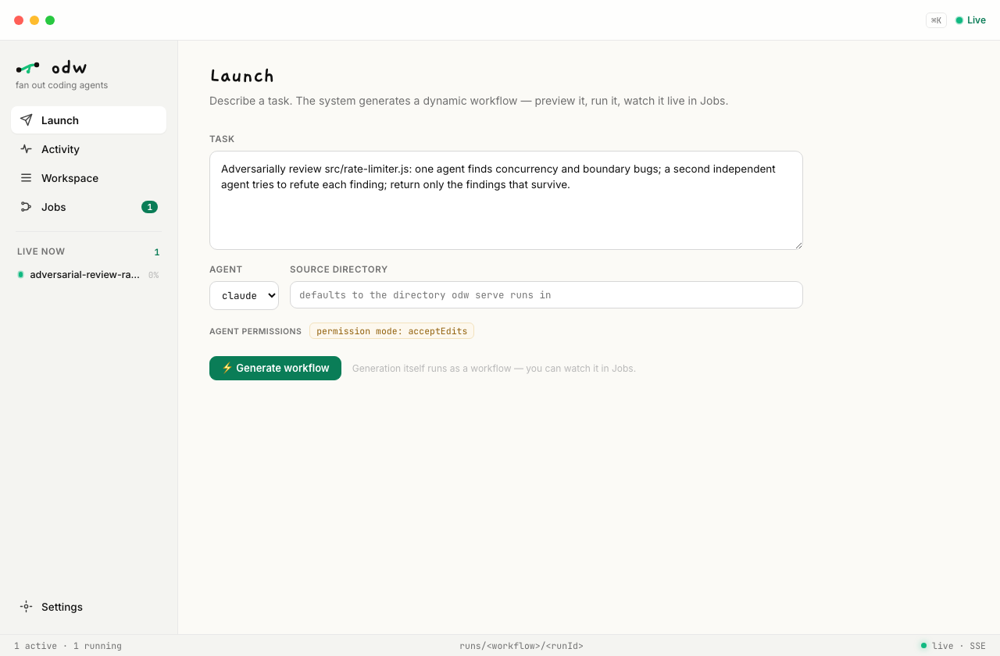
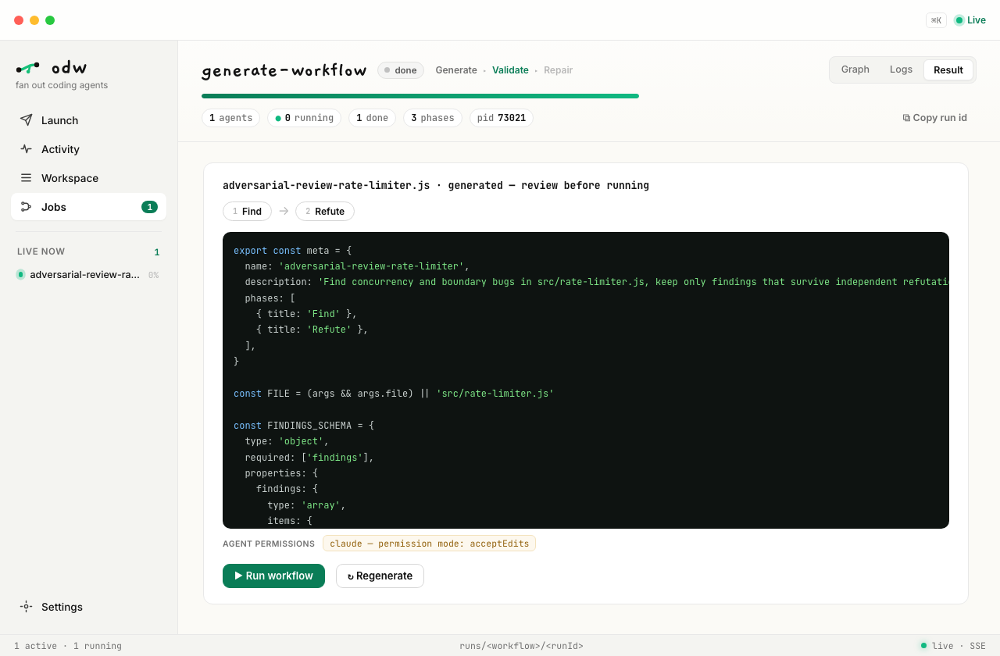
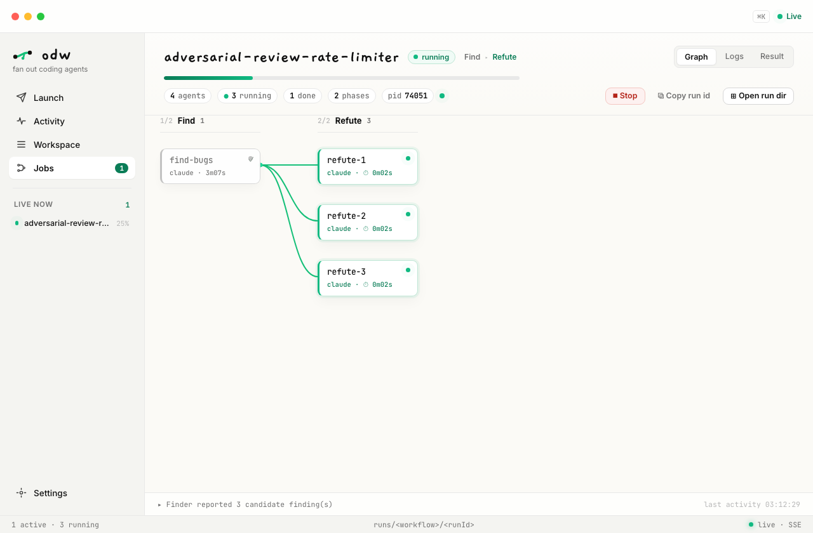

<div align="center">


# Open Dynamic Workflows

**Dynamic workflows for coding agents.** An open runtime that turns Codex, Claude Code,
Gemini, Qwen and Kimi into orchestrated fleets — same scripts as Claude Code's own
Workflow tool, plus a desktop app that generates, launches, and watches every run live.

[](LICENSE)
[](https://nodejs.org/)
[](tsconfig.json)
[](tests)
[](package.json)

[English](README.md) · [简体中文](README.zh-CN.md)

</div>

---

**Open Dynamic Workflows (ODW)** is a TypeScript / Node CLI runtime for
portable dynamic workflows: JavaScript scripts that fan out coding agents with
`agent()`, `parallel()`, and `pipeline()` outside the host agent's context. If
you are looking for an open dynamic workflow engine for Codex, Claude Code,
Gemini, Qwen, Kimi, or a custom CLI, this is the project.

A **dynamic workflow** is a small JavaScript script that holds an orchestration
plan in ordinary code and dispatches coding-agent CLIs *at scale* — outside the
host agent's own context. You write the script (or hand it one), a runtime runs
it in the background, and only the final result comes back. Claude Code can
already do this inside its own private runtime; ODW makes the **same scripts**
portable to any agent, so the workflows the Claude Code ecosystem is already
producing become artifacts you can run anywhere.

<div align="center">

<a href="videos/odw-demo/odw-product-demo.mp4">
  
</a>

<sub><b><a href="videos/odw-demo/odw-product-demo.mp4">▶ Watch the 33-second demo with sound</a></b> — author a workflow, fan agents out, and watch the run light up live.</sub>

</div>

## Why orchestrate at all?

Letting one agent grind in its own context tops out fast. Each row is a failure
mode you have probably met; each mechanism is a runnable pattern in this repo:

| One-agent failure mode | The dynamic-workflow answer |
| --- | --- |
| **Self-review bias** — the author grades its own work | Cross-CLI adversarial review: one adapter implements, a different one refutes ([`adversarial-verify.js`](examples/adversarial-verify.js), [`codex-claude-loop.js`](examples/codex-claude-loop.js)) |
| **One-shot quality lottery** | N approaches compete, pairwise judging picks a survivor ([`tournament.js`](examples/tournament.js)) |
| **Serial waiting** | `parallel()` fans subtasks across dozens of agent processes under a bounded semaphore ([`fan-out-reduce.js`](examples/fan-out-reduce.js)) |
| **Context pollution** — long work trashes the host agent's window | Runs are detached background workers; only the final `return` value comes back |
| **Invisible long runs** | Every run is a live DAG — browser dashboard, desktop observatory, or `odw logs --follow` |

## Highlights

- **Portable** — run the *same* workflow script on Codex, Claude Code, Gemini,
  Qwen, Kimi, or your own CLI. Switch the underlying agent by switching adapters.
- **Claude Code's dialect, complete** — `export const meta` + injected
  `agent` / `parallel` / `pipeline` / `phase` / `log` / `args` / `budget` /
  `workflow` globals (nested workflows included), with top-level `await` and
  `return`. A script written for Claude Code runs here as-is, and vice versa.
- **A launch pad, not just a viewer** — describe a task in the app, an agent
  generates the workflow (generation itself runs as a workflow), you preview the
  script and its agent permissions, run it, watch the live DAG, and save keepers
  to your workspace.
- **Out of context, at scale** — the plan lives in code, so intermediate work
  never pollutes the host's context and you can fan out dozens of subagents.
- **Reliable hand-offs** — JSON-Schema structured outputs, validated and retried,
  so multi-stage pipelines compose instead of guessing on free text.
- **Background & observable** — every run is a detached worker backed by a run
  directory: `status`, `logs --follow`, `result`, `pause` / `stop`.
- **No threads, zero runtime dependencies** — the engine is async TypeScript
  (`parallel` is `Promise.all`); workflow scripts stay plain `.js` and ship with
  `.d.ts` authoring types for editor autocomplete.

## Why not just use Claude Code's built-in Workflow tool?

Claude Code can already run dynamic workflows — but only inside its own private
runtime, for Claude Code itself. ODW makes the **same scripts** portable and
standalone:

- **Any agent, same script** — run a workflow on Codex, Gemini, Qwen, Kimi, or
  your own CLI, not just Claude Code. Switch the underlying agent by switching
  adapters.
- **Out of band** — runs are detached background workers backed by a run
  directory, so you can `status` / `logs --follow` / `pause` / `stop` them and
  watch from a browser or the desktop app — independent of any host agent session.
- **Portable artifacts** — the workflows the Claude Code ecosystem is already
  producing become files you can version, share, and run anywhere.

## Install

The whole install is **a binary + a skill** — no Node, no npm, no PATH
gymnastics, no global-module conflicts. Pick whichever path fits.

### 1. Let your AI agent install it

ODW is built for coding agents, so the easiest path is to let yours do it. Paste
this to your agent (Claude Code, Codex, Gemini, …):

> Install Open Dynamic Workflows for me: run
> `curl -fsSL https://raw.githubusercontent.com/xz1220/open-dynamic-workflows/main/scripts/install.sh | sh`
> to put the `odw` binary on my PATH and the workflow skill in your skills
> directory, then run `odw --version` to confirm. From now on, when a task is big
> enough to fan out, write an ODW workflow and run it with `odw run`.

It runs the script, picks up the [skill](skill/SKILL.md), and can author and run
workflows immediately.

### 2. One-command script

```bash
curl -fsSL https://raw.githubusercontent.com/xz1220/open-dynamic-workflows/main/scripts/install.sh | sh
```

Downloads the prebuilt binary for your platform (gzipped, ~35 MB) to
`~/.local/bin/odw` and installs the skill into `~/.claude/skills/` (falling back
to `~/.codex/skills/`). No Node required. Override with `ODW_BIN_DIR` /
`ODW_VERSION`.

### 3. Manual

Prefer not to pipe `curl` into `sh`? Grab the asset for your OS/arch from
[Releases](https://github.com/xz1220/open-dynamic-workflows/releases), then:

```bash
# a) the binary — onto your PATH
gunzip odw-darwin-arm64.gz && chmod +x odw-darwin-arm64
mv odw-darwin-arm64 ~/.local/bin/odw

# b) the skill — copy skill/ into your agent's skills dir
git clone https://github.com/xz1220/open-dynamic-workflows.git
cp -r open-dynamic-workflows/skill ~/.claude/skills/open-dynamic-workflows
```

Or, **once `odw` is published to npm** (not yet — see [Develop](#develop)) and you
have Node ≥20, `npm i -g odw` will put `odw` on your PATH (you'd still do step *b*
for the skill). For now, use the binary above.

> The on-disk binary is ~110 MB — almost entirely the embedded Node runtime, like
> any Node→binary tool — but the download is gzipped to ~35 MB. The agents ODW
> *drives* (`claude`, `codex`, …) remain their own CLIs you install separately.

## Quick start

ODW is mostly driven **by your coding agent**, not by hand. With the skill and
binary installed, just ask your agent for something big — it writes a workflow and
runs it for you, out of its own context:

> **You → your agent:** *"Use Open Dynamic Workflows to deep-research X vs Y and
> write me a cited report."*
>
> **Your agent** (it picked up the ODW skill) writes a workflow script and runs
> `odw run research.js --wait`, then hands back the report — dozens of searches
> and a fact-check pass ran in the background, never touching its context.

That's the whole point: the agent keeps a clean context and fans the heavy work
out to ODW.

**Running `odw` yourself** — or authoring a custom workflow — is the same one
command. A workflow is plain JavaScript in Claude Code's dialect, e.g.
`fan-out-reduce.js`:

```js
export const meta = {
  name: 'fan-out-reduce',
  description: 'Draft in parallel, then synthesize the best answer.',
}

const drafts = await parallel(
  [1, 2, 3, 4].map((i) => () => agent(`Draft #${i}: ${args.question}`)),
)

return await agent(
  'Synthesize the single best answer from these drafts:\n\n' +
    drafts.filter(Boolean).join('\n\n---\n\n'),
)
```

```bash
# from this repo's root (the script ships in examples/); any path works
odw run examples/fan-out-reduce.js --wait --args '{"question": "Design a rate limiter."}'
```

The flagship [`examples/deep-research.js`](examples/deep-research.js) (fan-out web
research → adversarial fact-check → cited report) is exactly such a script.

## The primitives

A workflow is `export const meta = {…}` followed by a script body that runs in an
async context. The body composes these **injected globals** with ordinary JS
control flow (loops, `if`, dedup) — no imports:

| Primitive | Role |
| --- | --- |
| `agent(prompt, opts?)` | Run one coding agent on a subtask. The only verb that does work. Returns its text, or a validated object when `opts.schema` is set. |
| `parallel(thunks)` | Run a batch concurrently and wait for all of it (**barrier**). A failed thunk becomes `null`. |
| `pipeline(items, ...stages)` | Stream each item through the stages independently (**no barrier**). Each stage gets `(prev, item, index)`. |
| `phase(title)` / `log(msg)` | Group progress under a phase / emit a progress line. |
| `schema` (JSON Schema) | A typed output contract for `agent`; the reply is validated and retried until it conforms. |
| `args` | The workflow's input, injected verbatim. |
| `budget` | `{ total, spent(), remaining() }` — scale depth to a token target. |
| `workflow(ref, args?)` | Run another workflow inline (one level deep). The child shares this run's concurrency cap, agent counter, and budget; its phases group as their own DAG lanes. |
| `validate(source)` | Compile-check a candidate workflow without executing it — the seam that lets workflows generate workflows. **ODW extension** (not in Claude Code's dialect). |

Use **`parallel`** when the next step needs the whole batch at once (dedup,
tally, synthesis); **`pipeline`** for multi-stage work (the default). Keep
reductions order-independent — branching on *which agent finished first* breaks
reproducibility. Full reference: [`skill/references/primitives.md`](skill/references/primitives.md).

## Run and observe

The `odw` CLI starts a script in a background worker (fire-and-poll) and lets you
watch it. `--wait` blocks and prints the result.

```bash
odw run wf.js [--args JSON|@file] [--wait]   # start (background); --wait blocks & prints result
                                             #   --adapter <name> sets this run's default agent
                                             #   --timeout <s> caps the wait; --budget <tokens> sets budget.total
odw status <id>          # state + agent count
odw logs <id> --follow   # stream progress events
odw result <id>          # final value
odw pause|resume|stop <id>
odw list
```

A run executes in a detached worker process and persists everything to a run
directory, so it outlives the command that started it and can be observed from
anywhere.

Saved workflows can also be run by name. ODW searches project workflows first,
then personal workflows, across both its own directories and Claude Code's saved
workflow directories: `.odw/workflows`, `.claude/workflows`, `~/.odw/workflows`,
and `~/.claude/workflows` (honoring `CLAUDE_CONFIG_DIR`).

**Prefer a browser?** `odw serve` opens a zero-dependency live dashboard onto the same
run directory — phase columns, per-agent cards (adapter + elapsed time), and run status
stream in real time over SSE. No build step, no extra deps.

```bash
odw serve [--open]                      # live dashboard at http://127.0.0.1:4317
odw serve --port 8080 --host 0.0.0.0    # custom port / bind address
```


**Prefer a native app?** The same dashboard ships as a read-only desktop
**observatory** (a Tauri shell) that keeps runs visible from the Dock / tray:

<table>
  <tr>
    <td width="50%">
      <strong>Activity</strong><br />
      
    </td>
    <td width="50%">
      <strong>Job detail</strong><br />
      
    </td>
  </tr>
</table>

## Launch: task in → running workflow out

The app is a launch pad as well as an observatory. Describe a task and pick an
agent; ODW **generates a dynamic workflow** for it — the generation itself runs
as a workflow (`Generate → Validate → Repair`), so you watch it as a live DAG
like any other job:

<table>
  <tr>
    <td width="50%">
      <strong>1 · Describe the task</strong><br />
      
    </td>
    <td width="50%">
      <strong>2 · Preview, then decide</strong><br />
      
    </td>
  </tr>
</table>

Nothing runs until you press **Run** — the preview shows the generated script,
its phases, and exactly what permission posture the chosen agent will run with.
After the run, **Save to Workspace** turns a good one-off into a named, reusable
workflow (`odw run <name>` works immediately).

<div align="center">
  
  <br /><sub><b>A real run of a generated workflow.</b> Task: “adversarially review <code>rate-limiter.js</code>”. The generated script's finder reported 3 candidate bugs; three parallel refuters then killed the plausible-but-wrong one (a “race” that can't actually interleave in single-threaded Node) and confirmed the two real ones — exactly what adversarial verification is for.</sub>
</div>

The same flow is scriptable:

```bash
curl -X POST http://127.0.0.1:4317/api/generate \
  -H 'content-type: application/json' \
  -d '{"task": "adversarially review src/rate-limiter.js", "adapter": "claude"}'
```

Write endpoints are loopback-only with CSRF/DNS-rebinding guards; binding
`--host` off-loopback keeps the dashboard readable but refuses every write.
Claude Code's own runs stay strictly read-only.

## Configure adapters

Codex, Claude Code, Gemini, Qwen, and Kimi work out of the box. To change the
default, tune flags, or add your own CLI, drop an `odw.config.json` (see
[`odw.config.example.json`](odw.config.example.json)) in the project root,
`~/.config/odw/config.json`, or pass `--config`. ODW only shells out to local
commands — it never calls model APIs directly.

```jsonc
{
  "defaultAdapter": "claude",
  "concurrency": 8,
  "adapters": {
    "my_wrapper": {
      "label": "My custom CLI",
      "command": ["my-agent", "--cwd", "{workspace}", "--prompt-file", "{prompt_file}"]
    }
  }
}
```

Config keys live at the **top level** — there is no `"settings"` wrapper, and odw
warns about unknown or misplaced keys (with a did-you-mean hint) instead of
silently ignoring them. With no `defaultAdapter` set, odw uses the sole
configured adapter — or, on a fresh install, the sole adapter whose CLI it
actually finds on PATH; if several are installed, the error lists them and shows
how to pick one.

## How it works

```
odw (CLI) ─▶ runtime (background worker + run directory)
               └─ loads & transforms ─▶ workflow script (.js, Claude dialect)
                                         └─ injected primitives ─▶ scheduler (async cap + agent backstop)
                                             agent() ─▶ bridge ─▶ adapters ─▶ real CLI subprocess
                                                         ├─ workspace (isolation + diff)
                                                         └─ schema (validate / retry)
```

Two design points are worth calling out:

- **The loader is the crux.** Claude's dialect is neither a normal ES module nor
  a plain script: `export const meta` sits up top, and the body uses top-level
  `await` *and* top-level `return` while referencing injected globals. The loader
  extracts `meta` (with a string/comment/regex-aware scan), strips the `export`,
  and wraps the body in an async function whose parameters *are* the primitives —
  so the body's `return` becomes the workflow's result.
- **No threads.** The engine is async to the core. `agent()` is just an async
  subprocess call, so `parallel` is `Promise.all`, `pipeline` is per-item async
  chains, and the concurrency cap is a small async semaphore — `min(16, cpus-2)`
  by default, with a hard backstop on total dispatches per run.

| Path | Layer |
| --- | --- |
| `src/adapters/` | L1 — uniform CLI invocation (config, placeholders, runner, built-ins) |
| `src/bridge.ts` | L2 — one `agent` call → one CLI run, with schema handling |
| `src/scheduler.ts` | L3 — bounded async concurrency + total-agent backstop |
| `src/primitives.ts`, `src/schema.ts` | L4 — the injected primitives + the data contract |
| `src/loader.ts` | the transform that turns a workflow script into a runnable form |
| `src/runtime/` | L5 — background worker, run directory, control |
| `src/cli.ts` | L6 — the `odw` command |
| `src/workspace.ts` | cross-cutting — workspace isolation and diff |

Workflow scripts stay **plain `.js`** and are never compiled; the engine is
written in **TypeScript** (compiled to ESM, **zero runtime dependencies**) and
ships `.d.ts` authoring types so script authors get editor autocomplete on the
injected globals.

## Examples

Runnable, plain-JS workflows in [`examples/`](examples/):

| Workflow | Pattern |
| --- | --- |
| [`deep-research.js`](examples/deep-research.js) | fan-out research → adversarial fact-check → cited report |
| [`fan-out-reduce.js`](examples/fan-out-reduce.js) | draft N in parallel → synthesize the best |
| [`adversarial-verify.js`](examples/adversarial-verify.js) | surface findings → keep only those that survive refutation |
| [`loop-until-dry.js`](examples/loop-until-dry.js) | loop fanning out finders until K dry rounds |
| [`routing.js`](examples/routing.js) | classify the request → route to a specialist → grade the result |
| [`generate-and-filter.js`](examples/generate-and-filter.js) | generate many ideas in parallel → dedupe → keep only rubric-passers |
| [`tournament.js`](examples/tournament.js) | N approaches attempt the task → pairwise judging bracket → one winner |
| [`codex-claude-loop.js`](examples/codex-claude-loop.js) | two rival CLIs in a turn-based duel: Claude implements, Codex reviews, repeat until sign-off |
| [`agent-daily-digest.js`](examples/agent-daily-digest.js) | discover sources → extract in parallel → synthesize → verify |

## Develop

```bash
npm run build         # tsc → dist/
npm test              # node:test suite, driven by a mock adapter (no real accounts)
npm run typecheck     # tsc --noEmit
npm run build:binary  # bundle + Node SEA + postject → a single self-contained ./build/odw
```

`build:binary` follows the standard single-executable recipe: [esbuild](https://esbuild.github.io/)
bundles `dist/` (zero-dep ESM) into one CommonJS file, `node --experimental-sea-config`
turns it into a [SEA](https://nodejs.org/api/single-executable-applications.html)
blob, and [postject](https://github.com/nodejs/postject) grafts that blob into a
copy of the `node` binary (ad-hoc code-signed on macOS). esbuild and postject are
**build-only devDependencies** — the binary and the npm package stay zero
*runtime* dependencies. Cross-platform binaries are built per-OS in CI
([`.github/workflows/release.yml`](.github/workflows/release.yml)); SEA injects
into the host's `node`, so each target is built on its own runner.

> Once published, `npm i -g odw` (or `npx odw …`) puts the `odw` command on your PATH.

## Status

**What's new (unreleased, on `main`):** the **launch layer** — the app upgrades
from observatory to launch pad. Describe a task → an agent **generates a
workflow** (generation runs as a workflow, watchable live) → preview the script
+ agent permissions → run → save keepers to the Workspace. Under the hood the
dialect got **complete**: nested `workflow()` is implemented (shared scheduler/
budget, one level deep), `budget.spent()` does real (estimated) accounting so
`--budget` is a hard ceiling, plus `odw run --adapter <name>`, inline-source
runs archived in their run directory, and a `validate()` primitive so workflows
can generate workflows.

**v0.3.0:** the **Jobs** tab also surfaces **Claude Code's own workflow runs** —
finished history and live in-flight jobs — read-only, merged alongside ODW's own
runs. (v0.2.4 added the desktop **observatory** app itself.) See
[Releases](https://github.com/xz1220/open-dynamic-workflows/releases).

**Core runtime is shipped.** The full runtime is on `main` — the adapter layer, execution
bridge, workspace isolation, the async scheduler, the injected primitives, the
loader/transform, the JSON-Schema engine, the background runtime, and the `odw`
CLI. **235 tests pass**, and the flagship [`examples/deep-research.js`](examples/deep-research.js)
runs end-to-end (plan → gather → verify → synthesize → critique).

### Roadmap (v1.5+)

`model` / `agentType` rich routing · git-worktree `isolation` · adapter-reported
token usage (today's budget meters an estimate) · resume / journaling · a
`Date.now`/`Math.random` sandbox for replay-determinism. Full plan:
[`docs/dynamic-workflows-tech-plan.md`](docs/dynamic-workflows-tech-plan.md).
Background on the Claude Code dialect ODW aligns with:
[`docs/dynamic-workflows-research.md`](docs/dynamic-workflows-research.md).

## Use as a skill

[`skill/SKILL.md`](skill/SKILL.md) (简体中文: [`skill/zh-CN/SKILL.md`](skill/zh-CN/SKILL.md))
teaches a host agent to author and run workflows from documentation alone —
install it into your agent's skills directory (Codex CLI → `~/.codex/skills/`,
Claude Code → its skills dir).

## FAQ

<details>
<summary><b>How is this different from a CLAUDE.md / AGENTS.md / a skill?</b></summary>

Those teach an agent how to behave <i>inside its own context</i>. A dynamic
workflow moves the work <i>out</i>: the plan lives in a script, the subtasks run
as separate agent processes at scale, and only the final value returns. ODW
ships a skill too — but the skill's job is to teach your agent to write and run
workflows, not to be the orchestration.
</details>

<details>
<summary><b>How is this different from LangGraph / n8n / Airflow?</b></summary>

Those orchestrate API calls and custom nodes. ODW orchestrates <b>coding-agent
CLIs</b> — the agents you already pay for and configure (Codex, Claude Code,
Gemini, …) — in their own working directories, with workspace isolation and
diffs. There is no DSL and no server farm: a workflow is one plain JavaScript
file in Claude Code's existing dialect, and the engine is a zero-dependency
Node CLI.
</details>

<details>
<summary><b>Does ODW call model APIs directly?</b></summary>

No. ODW only shells out to local CLIs you already authenticated. No API keys,
no token billing of its own, no network calls from the engine.
</details>

<details>
<summary><b>Can a web page drive my local agents through <code>odw serve</code>?</b></summary>

No. Write endpoints require <code>Content-Type: application/json</code> and a
same-origin Origin, the Host header is allowlisted against DNS rebinding, and
any off-loopback bind refuses writes entirely (the dashboard stays readable).
</details>

<details>
<summary><b>Is the desktop app available for Linux / Windows?</b></summary>

Not yet — macOS first (the web dashboard via <code>odw serve</code> is
cross-platform today). The app is a thin Tauri shell over the same single-file
SPA, so a port is packaging work, not a rewrite.
</details>

## Star history

<a href="https://star-history.com/#xz1220/open-dynamic-workflows&Date">
  <picture>
    <source media="(prefers-color-scheme: dark)" srcset="https://api.star-history.com/svg?repos=xz1220/open-dynamic-workflows&type=Date&theme=dark" />
    <source media="(prefers-color-scheme: light)" srcset="https://api.star-history.com/svg?repos=xz1220/open-dynamic-workflows&type=Date" />
    
  </picture>
</a>

## License

[MIT](LICENSE)
