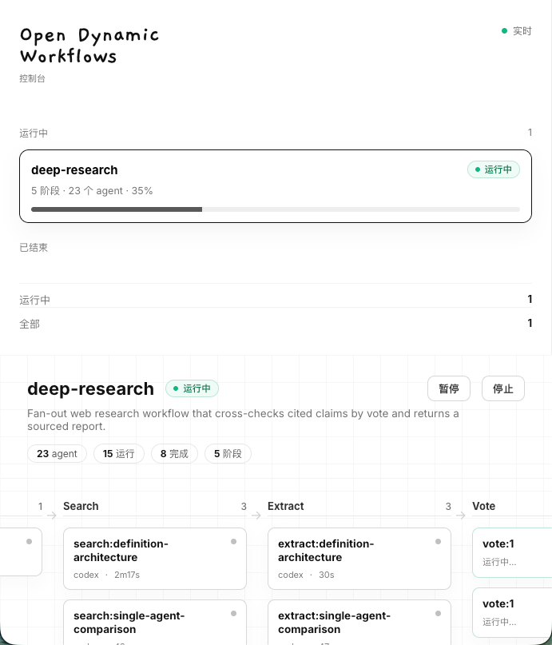
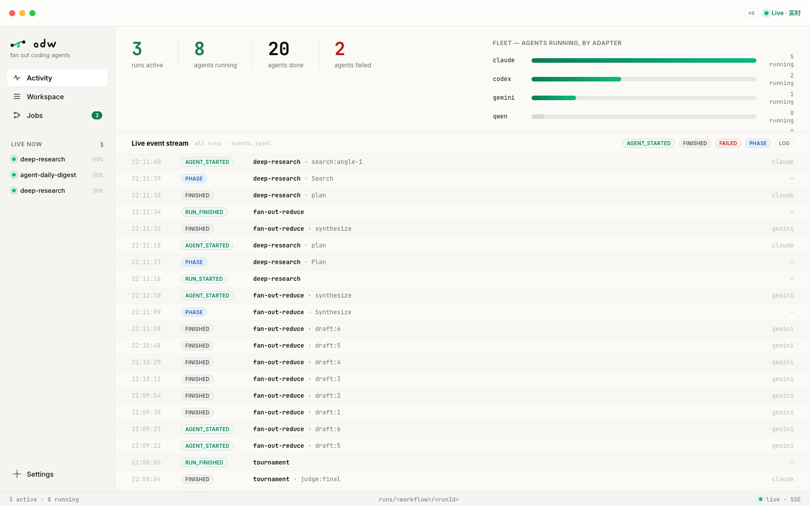
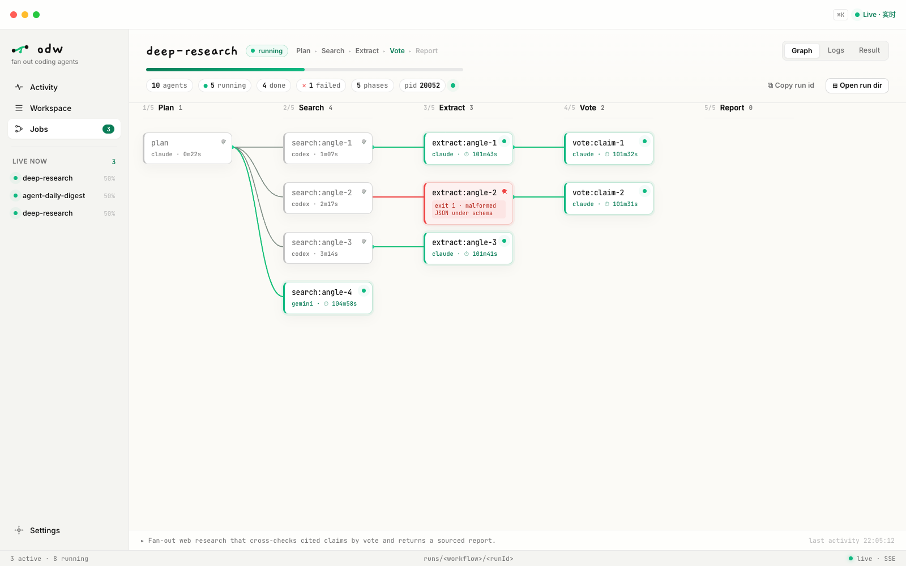

<div align="center">


# Open Dynamic Workflows

**一个开放的 Claude Code 式 _dynamic workflow_ 运行时——同一份 agent 编排脚本,可跑在任意 coding agent 上(Codex、Claude、Gemini、Qwen、Kimi)。**

[](LICENSE)
[](https://nodejs.org/)
[](tsconfig.json)
[](tests)
[](package.json)

[English](README.md) · [简体中文](README.zh-CN.md)

</div>

---

**Open Dynamic Workflows(ODW)** 是一个 TypeScript / Node CLI 运行时,面向可移植的
dynamic workflow:用 JavaScript 脚本在宿主 agent 上下文之外,通过 `agent()`、
`parallel()`、`pipeline()` 扇出并编排 coding agent。如果你在找一个 open dynamic
workflow engine,想让 Codex、Claude Code、Gemini、Qwen、Kimi 或自定义 CLI 都能跑同一份
workflow 脚本,这就是这个项目。

**dynamic workflow** 是一段小小的 JavaScript 脚本:它把编排计划放在普通代码里,在宿主
agent 的上下文**之外**、**大规模**地调度 coding-agent CLI。你写好脚本(或拿到一个),
运行时在后台把它跑完,只把最终结果交回来。Claude Code 已经能在它自己的私有运行时里做
这件事;ODW 把**同一份脚本**做成可移植的——于是 Claude Code 生态里已经在大量产出的
workflow,就成了你在任何 agent 上都能跑的资产。

<div align="center">

<a href="videos/odw-demo/odw-product-demo.mp4">
  
</a>

<sub><b><a href="videos/odw-demo/odw-product-demo.mp4">▶ 观看 33 秒演示(带声音)</a></b> —— 写一个 workflow、把 agent 扇出去,看整个运行实时点亮。</sub>

</div>

## 亮点

- **可移植** —— 同一份 workflow 脚本可跑在 Codex、Claude Code、Gemini、Qwen、Kimi 或你
  自己的 CLI 上;换底层 agent 只需换适配器。
- **Claude Code 方言,原样可跑** —— `export const meta` + 注入的 `agent` / `parallel` /
  `pipeline` / `phase` / `log` / `args` / `budget` 全局,支持顶层 `await` 和 `return`。
  为 Claude Code 写的脚本在这里照跑,反之亦然。
- **在上下文之外、大规模** —— 计划留在代码里,中间产物不污染宿主上下文,可扇出几十个
  subagent。
- **可靠的交接** —— JSON-Schema 结构化输出,自动校验与重试,让多阶段流水线稳定组合,而
  不是在自由文本上碰运气。
- **后台运行、可观测** —— 每次运行都是一个 detached worker + run 目录:`status`、
  `logs --follow`、`result`、`pause` / `stop`。
- **无线程、零运行时依赖** —— 引擎是异步 TypeScript(`parallel` 就是 `Promise.all`);
  workflow 脚本保持纯 `.js`,并附带 `.d.ts` 类型供编辑器补全。

## 为什么不直接用 Claude Code 内置的 Workflow 工具?

Claude Code 已经能跑 dynamic workflow——但只能在它自己的私有运行时里、只为 Claude Code
自己跑。ODW 把**同一份脚本**做成可移植、可独立运行的:

- **任意 agent,同一份脚本** —— workflow 不止能跑 Claude Code,还能跑 Codex、Gemini、
  Qwen、Kimi 或你自己的 CLI;换底层 agent 只需换适配器。
- **带外运行** —— 每次运行都是 detached 后台 worker + run 目录,所以你能对它
  `status` / `logs --follow` / `pause` / `stop`,并从浏览器或桌面 App 观测——不依赖任何
  宿主 agent 会话。
- **可移植的资产** —— Claude Code 生态已经在产出的 workflow,就此成为你可以版本化、分享、
  并在任何地方运行的文件。

## 安装

整个安装就是 **一个二进制 + 一个 skill**——无需 Node、无需 npm、不用折腾 PATH、没有
全局模块冲突。挑一种适合你的:

### 1. 让你的 AI Agent 自己装

ODW 本来就是给 coding agent 用的,最省事的就是让它自己装。把下面这段**粘给你的 agent**
(Claude Code、Codex、Gemini …):

> Install Open Dynamic Workflows for me: run
> `curl -fsSL https://raw.githubusercontent.com/xz1220/open-dynamic-workflows/main/scripts/install.sh | sh`
> to put the `odw` binary on my PATH and the workflow skill in your skills
> directory, then run `odw --version` to confirm. From now on, when a task is big
> enough to fan out, write an ODW workflow and run it with `odw run`.

它会跑这个脚本、加载 [skill](skill/SKILL.md),然后立刻就能写并跑 workflow。

### 2. 一键脚本

```bash
curl -fsSL https://raw.githubusercontent.com/xz1220/open-dynamic-workflows/main/scripts/install.sh | sh
```

自动下对应平台的预编译二进制(gzip,约 35 MB)到 `~/.local/bin/odw`,并把 skill 装进
`~/.claude/skills/`(没有就退到 `~/.codex/skills/`)。无需 Node。可用环境变量
`ODW_BIN_DIR` / `ODW_VERSION` 覆盖。

### 3. 手动安装

不想把 `curl` 管道丢给 `sh`?从
[Releases](https://github.com/xz1220/open-dynamic-workflows/releases) 下对应 OS/arch 的资产,然后:

```bash
# a) 二进制 —— 放到 PATH 上
gunzip odw-darwin-arm64.gz && chmod +x odw-darwin-arm64
mv odw-darwin-arm64 ~/.local/bin/odw

# b) skill —— 把 skill/ 拷进 agent 的 skills 目录
git clone https://github.com/xz1220/open-dynamic-workflows.git
cp -r open-dynamic-workflows/skill ~/.claude/skills/open-dynamic-workflows
```

或者,**等 `odw` 发布到 npm 之后**(目前还没有——见 [开发](#开发))、且你有 Node ≥20,
`npm i -g odw` 就能把 `odw` 装到 PATH 上(skill 仍按上面第 *b* 步装)。在那之前请用上面的二进制。

> 二进制在磁盘上约 110 MB——和任何 Node→二进制 的工具一样,几乎全是内嵌的 Node 运行
> 时——但下载已 gzip 压到约 35 MB。ODW 所**驱动**的 agent(`claude`、`codex` …)仍是你
> 另行安装的独立 CLI。

## 快速开始

ODW 主要是**被你的 coding agent 驱动**的,不是手动跑。装好 skill 和二进制后,你只要把一个
大任务丢给 agent——它会**自己写一个 workflow 并跑起来**,而且是在它自己的上下文之外:

> **你 → 你的 agent:** *"用 Open Dynamic Workflows 深度调研 X 和 Y 的取舍,给我一份带引用
> 的报告。"*
>
> **你的 agent**(已经加载了 ODW skill)写一个 workflow 脚本、跑 `odw run research.js
> --wait`,然后把报告交回来——几十次检索和一轮事实核查都在后台跑完,全程不碰它的上下文。

这正是重点:**agent 保持干净的上下文,把重活扇出给 ODW。**

**你自己跑 `odw`**(或自己写一个 workflow)也是同一条命令。一个 workflow 就是 Claude Code
方言的纯 JavaScript,比如 `fan-out-reduce.js`:

```js
export const meta = {
  name: 'fan-out-reduce',
  description: 'Draft in parallel, then synthesize the best answer.',
}

const drafts = await parallel(
  [1, 2, 3, 4].map((i) => () => agent(`Draft #${i}: ${args.question}`)),
)

return await agent(
  'Synthesize the single best answer from these drafts:\n\n' +
    drafts.filter(Boolean).join('\n\n---\n\n'),
)
```

```bash
odw run fan-out-reduce.js --wait --args '{"question": "Design a rate limiter."}'
```

旗舰示例 [`examples/deep-research.js`](examples/deep-research.js)(扇出式联网调研 → 对抗式
事实核查 → 带引用报告)正是这样一个脚本。

## 编程原语

一个 workflow = `export const meta = {…}` + 一段运行在 async 上下文里的脚本体。脚本体
用普通 JS 控制流(循环、`if`、去重)把这些**注入的全局**串起来——无需 import:

| 原语 | 作用 |
| --- | --- |
| `agent(prompt, opts?)` | 让一个 coding agent 跑一个子任务。唯一真正"产出工作"的原语。返回文本;设了 `opts.schema` 则返回校验过的对象。 |
| `parallel(thunks)` | 一组任务并发执行、**等全部完成**(屏障)。失败的那个变 `null`。 |
| `pipeline(items, ...stages)` | 每个条目独立穿过各 stage(**无屏障**)。每个 stage 收 `(prev, item, index)`。 |
| `phase(title)` / `log(msg)` | 把进度归入某阶段 / 发一行进度消息。 |
| `schema`(JSON Schema) | 给 `agent` 的输出定一个类型契约;回复会被校验,不符就重试。 |
| `args` | workflow 的输入,原样注入。 |
| `budget` | `{ total, spent(), remaining() }`——按 token 目标动态扩缩深度。 |
| `workflow(ref, args?)` | 内联调用另一个 workflow(一层嵌套;v1.5+)。 |

下一步需要"全量结果一次到位"(去重、计票、综合)时用 **`parallel`**;多阶段处理默认用
**`pipeline`**。归并要保持顺序无关——按"谁先跑完"分支会破坏可复现性。完整参考见
[`skill/references/primitives.md`](skill/references/primitives.md)。

## 运行与观测

`odw` CLI 在后台 worker 里启动脚本(fire-and-poll),并让你观测它。`--wait` 会阻塞并
打印结果。

```bash
odw run wf.js [--args JSON|@file] [--wait]   # 启动(后台);--wait 阻塞并打印结果
odw status <id>          # 状态 + agent 计数
odw logs <id> --follow   # 流式输出进度事件
odw result <id>          # 最终值
odw pause|resume|stop <id>
odw list
```

一次运行在独立的 detached worker 进程里执行,并把一切持久化到一个 run 目录——所以它能
比启动它的命令活得更久,也能从任何地方被观测。

保存好的 workflow 也可以直接按名字运行。ODW 会先找项目级、再找个人级,并同时读取自己
的目录和 Claude Code 保存 workflow 的目录: `.odw/workflows`、`.claude/workflows`、
`~/.odw/workflows`、`~/.claude/workflows`(遵循 `CLAUDE_CONFIG_DIR`)。

**喜欢用浏览器?** `odw serve` 会对同一个 run 目录开一个零依赖的实时仪表盘——阶段分栏、
每个 agent 的卡片(适配器 + 耗时)、运行状态都通过 SSE 实时更新。无需构建,不引入任何
额外依赖。

```bash
odw serve [--open]                      # 实时仪表盘,默认 http://127.0.0.1:4317
odw serve --port 8080 --host 0.0.0.0    # 自定义端口 / 绑定地址
```



**更想要原生 App?** 同一套看板也以只读桌面**观测台**(Tauri 壳)的形式发布,可从 Dock /
托盘随时看到运行:

<table>
  <tr>
    <td width="50%">
      <strong>Activity</strong><br />
      
    </td>
    <td width="50%">
      <strong>Job detail</strong><br />
      
    </td>
  </tr>
</table>

## 配置适配器

Codex、Claude Code、Gemini、Qwen、Kimi 开箱即用。要改默认、调参或加自己的 CLI,放一个
`odw.config.json`(见 [`odw.config.example.json`](odw.config.example.json))到项目根、
`~/.config/odw/config.json`,或用 `--config` 指定。ODW 只调用本地命令——绝不直接调
模型 API。

```jsonc
{
  "defaultAdapter": "claude",
  "concurrency": 8,
  "adapters": {
    "my_wrapper": {
      "label": "My custom CLI",
      "command": ["my-agent", "--cwd", "{workspace}", "--prompt-file", "{prompt_file}"]
    }
  }
}
```

## 工作原理

```
odw (CLI) ─▶ runtime(后台 worker + run 目录)
               └─ 加载并转换 ─▶ workflow 脚本(.js,Claude 方言)
                                  └─ 注入原语 ─▶ scheduler(async 并发上限 + agent 兜底)
                                      agent() ─▶ bridge ─▶ adapters ─▶ 真实 CLI 子进程
                                                  ├─ workspace(隔离 + diff)
                                                  └─ schema(校验 / 重试)
```

两个值得点出的设计:

- **loader 是关键。** Claude 的方言既不是标准 ES module 也不是普通脚本:`export const meta`
  在顶部,脚本体用了顶层 `await` **和**顶层 `return`,还引用注入的全局。loader 会(用
  字符串/注释/正则感知的扫描)抽出 `meta`、去掉 `export`,再把脚本体包进一个 async 函数,
  其参数**就是**那些原语——于是脚本体的 `return` 就变成 workflow 的返回值。
- **没有线程。** 引擎彻头彻尾是异步的。`agent()` 不过是一次异步子进程调用,所以
  `parallel` 就是 `Promise.all`、`pipeline` 是逐条目的 async 链,并发上限只是一个小小的
  异步信号量——默认 `min(16, CPU核数-2)`,外加一个单次运行总派发量的硬兜底。

| 路径 | 层 |
| --- | --- |
| `src/adapters/` | L1 — 统一的 CLI 调用(配置、占位符、runner、内置适配器) |
| `src/bridge.ts` | L2 — 一次 `agent` 调用 → 一次 CLI 运行,含 schema 处理 |
| `src/scheduler.ts` | L3 — 有界的异步并发 + agent 总量兜底 |
| `src/primitives.ts`、`src/schema.ts` | L4 — 注入的原语 + 数据契约 |
| `src/loader.ts` | 把 workflow 脚本转成可运行形态的转换器 |
| `src/runtime/` | L5 — 后台 worker、run 目录、控制 |
| `src/cli.ts` | L6 — `odw` 命令 |
| `src/workspace.ts` | 横切 — 工作区隔离与 diff |

workflow 脚本始终是**纯 `.js`**、从不编译;引擎用 **TypeScript** 写(编译成 ESM,
**零运行时依赖**),并附带 `.d.ts` authoring 类型,让脚本作者在编辑器里对注入的全局有
自动补全。

## 示例

[`examples/`](examples/) 里是可运行的纯 JS workflow:

| Workflow | 形态 |
| --- | --- |
| [`deep-research.js`](examples/deep-research.js) | 扇出调研 → 对抗式事实核查 → 带引用报告 |
| [`fan-out-reduce.js`](examples/fan-out-reduce.js) | 并行起草 N 份 → 综合出最佳 |
| [`adversarial-verify.js`](examples/adversarial-verify.js) | 产出发现 → 只保留扛住证伪的 |
| [`loop-until-dry.js`](examples/loop-until-dry.js) | 循环扇出 finder,连续 K 轮无新发现才停 |
| [`routing.js`](examples/routing.js) | 给请求分类 → 路由到对应专家 → 给结果打分 |
| [`generate-and-filter.js`](examples/generate-and-filter.js) | 并行产出大量点子 → 去重 → 只留过 rubric 的 |
| [`tournament.js`](examples/tournament.js) | N 种思路各自解题 → 两两评判晋级 → 决出唯一胜者 |

## 开发

```bash
npm run build         # tsc → dist/
npm test              # node:test 测试套件,由 mock 适配器驱动(无需真实账号)
npm run typecheck     # tsc --noEmit
npm run build:binary  # 打包 + Node SEA + postject → 单个自包含的 ./build/odw
```

`build:binary` 走的是标准的单二进制配方:[esbuild](https://esbuild.github.io/) 把
`dist/`(零依赖 ESM)打包成一个 CommonJS 文件,`node --experimental-sea-config` 生成
[SEA](https://nodejs.org/api/single-executable-applications.html) blob,再由
[postject](https://github.com/nodejs/postject) 把 blob 注入到一份 `node` 二进制的拷贝里
(macOS 下做 ad-hoc 签名)。esbuild 和 postject 都是**仅构建用的 devDependency**——
二进制和 npm 包仍保持零**运行时**依赖。跨平台二进制在 CI 里按操作系统分别构建
([`.github/workflows/release.yml`](.github/workflows/release.yml)):SEA 注入的是宿主
机的 `node`,所以每个目标平台都要在各自的 runner 上构建。

> 发布后,`npm i -g odw`(或 `npx odw …`)会把 `odw` 命令装到你的 PATH 上。

## 状态

**v0.3.0 新增:****Jobs** 标签页现在也会展示 **Claude Code 自己的 workflow 运行**——
既有已完成的历史,也有正在跑的实时任务——只读,并与 ODW 自己的 run 合并在一起,
一个观测台即可看到本机上所有的动态 workflow。(v0.2.4 带来了观测台 App 本身:
Activity / Jobs / Job detail + `.odw/`–`.claude/` workflow 工作区。)见
[Releases](https://github.com/xz1220/open-dynamic-workflows/releases)。

**核心运行时已交付。** 完整运行时已在 `main` 上——适配层、执行桥接、工作区隔离、异步调度器、
注入原语、loader/transform、JSON-Schema 引擎、后台运行时,以及 `odw` CLI。**129 个测试
通过**,旗舰示例 [`examples/deep-research.js`](examples/deep-research.js) 端到端跑通
(plan → gather → verify → synthesize → critique)。

### 路线图(v1.5+)

`model` / `agentType` 富路由 · git-worktree `isolation` · 嵌套 `workflow()` · 真实
token 预算计量 · resume / journaling · 用于可重放确定性的 `Date.now`/`Math.random` 沙箱。
完整方案见 [`docs/dynamic-workflows-tech-plan.md`](docs/dynamic-workflows-tech-plan.md);
ODW 所对齐的 Claude Code 方言背景见
[`docs/dynamic-workflows-research.md`](docs/dynamic-workflows-research.md)。

## 作为 skill 使用

[`skill/SKILL.md`](skill/SKILL.md) 让宿主 agent 仅凭文档就能编写并运行 workflow——把它
装进你的 agent 的 skills 目录(Codex CLI → `~/.codex/skills/`,Claude Code → 它的
skills 目录)。

## Star 趋势

<a href="https://star-history.com/#xz1220/open-dynamic-workflows&Date">
  <picture>
    <source media="(prefers-color-scheme: dark)" srcset="https://api.star-history.com/svg?repos=xz1220/open-dynamic-workflows&type=Date&theme=dark" />
    <source media="(prefers-color-scheme: light)" srcset="https://api.star-history.com/svg?repos=xz1220/open-dynamic-workflows&type=Date" />
    
  </picture>
</a>

## 许可证

[MIT](LICENSE)
